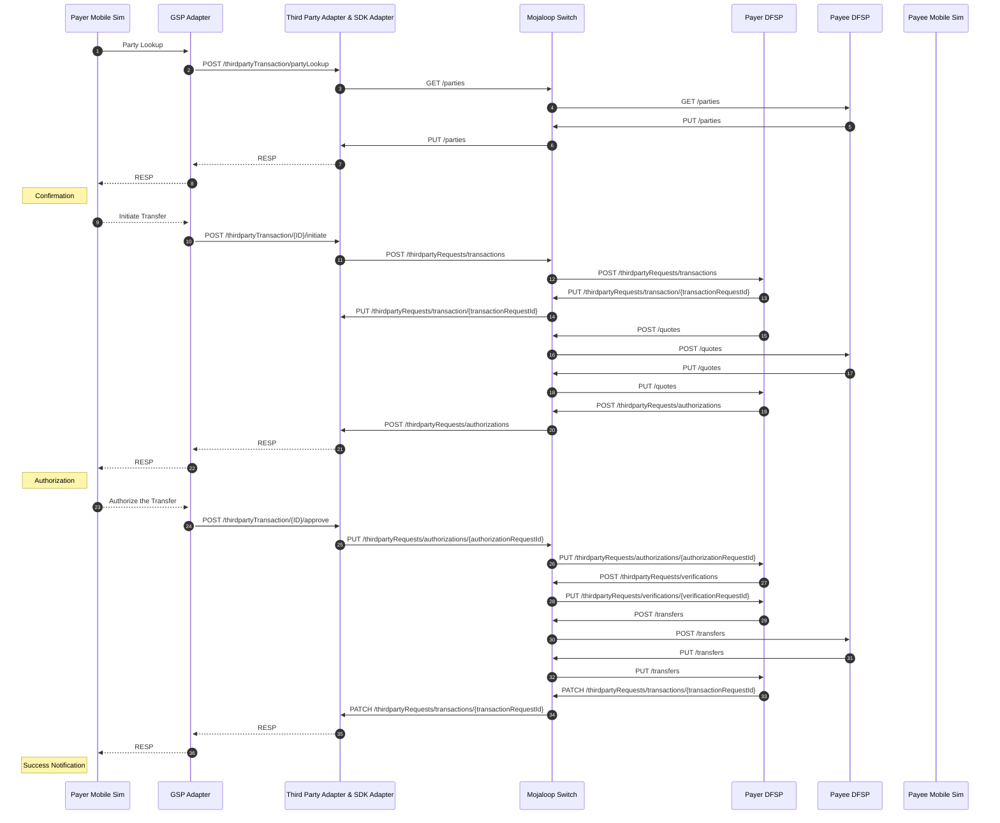

```mermaid
sequenceDiagram
    autonumber

    participant PayerMobileSim as Payer Mobile Sim
    participant GSPAdapter as GSP Adapter
    participant ThirdPartyAdapter as Third Party Adapter & SDK Adapter
    participant MojaloopSwitch as Mojaloop Switch
    participant PayerDFSP as Payer DFSP
    participant PayeeDFSP as Payee DFSP
    participant PayeeMobileSim as Payee Mobile Sim

    PayerMobileSim->>+GSPAdapter: Party Lookup
    GSPAdapter->>ThirdPartyAdapter: POST /thirdpartyTransaction/partyLookup
    ThirdPartyAdapter->>MojaloopSwitch: GET /parties
    MojaloopSwitch->>PayeeDFSP: GET /parties
    PayeeDFSP->>MojaloopSwitch: PUT /parties
    MojaloopSwitch->>ThirdPartyAdapter: PUT /parties
    ThirdPartyAdapter-->>GSPAdapter: RESP
    GSPAdapter-->>PayerMobileSim: RESP
    Note left of PayerMobileSim: Confirmation

    PayerMobileSim-->>GSPAdapter: Initiate Transfer
    GSPAdapter->>ThirdPartyAdapter: POST /thirdpartyTransaction/{ID}/initiate
    ThirdPartyAdapter->>MojaloopSwitch: POST /thirdpartyRequests/transactions
    MojaloopSwitch->>PayerDFSP: POST /thirdpartyRequests/transactions
    PayerDFSP->>MojaloopSwitch: PUT /thirdpartyRequests/transaction/{transactionRequestId}
    MojaloopSwitch->>ThirdPartyAdapter: PUT /thirdpartyRequests/transaction/{transactionRequestId}
    PayerDFSP->>MojaloopSwitch: POST /quotes
    MojaloopSwitch->>PayeeDFSP: POST /quotes
    PayeeDFSP->>MojaloopSwitch: PUT /quotes
    MojaloopSwitch->>PayerDFSP: PUT /quotes
    PayerDFSP->>MojaloopSwitch: POST /thirdpartyRequests/authorizations
    MojaloopSwitch->>ThirdPartyAdapter: POST /thirdpartyRequests/authorizations
    ThirdPartyAdapter-->>GSPAdapter: RESP
    GSPAdapter-->>PayerMobileSim: RESP
    Note left of PayerMobileSim: Authorization

    PayerMobileSim-->>GSPAdapter: Authorize the Transfer
    GSPAdapter->>ThirdPartyAdapter: POST /thirdpartyTransaction/{ID}/approve
    ThirdPartyAdapter->>MojaloopSwitch: PUT /thirdpartyRequests/authorizations/{authorizationRequestId}
    MojaloopSwitch->>PayerDFSP: PUT /thirdpartyRequests/authorizations/{authorizationRequestId}
    PayerDFSP->>MojaloopSwitch: POST /thirdpartyRequests/verifications
    MojaloopSwitch->>PayerDFSP: PUT /thirdpartyRequests/verifications/{verificationRequestId}
    PayerDFSP->>MojaloopSwitch: POST /transfers
    MojaloopSwitch->>PayeeDFSP: POST /transfers
    PayeeDFSP->>MojaloopSwitch: PUT /transfers
    MojaloopSwitch->>PayerDFSP: PUT /transfers
    PayerDFSP->>MojaloopSwitch: PATCH /thirdpartyRequests/transactions/{transactionRequestId}
    MojaloopSwitch->>ThirdPartyAdapter: PATCH /thirdpartyRequests/transactions/{transactionRequestId}
    ThirdPartyAdapter-->>GSPAdapter: RESP
    GSPAdapter-->>PayerMobileSim: RESP
    Note left of PayerMobileSim: Success Notification

```
