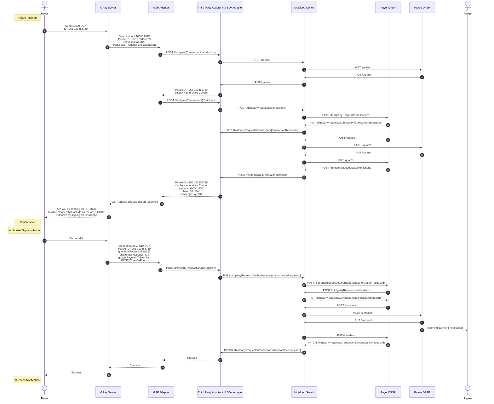

```mermaid

sequenceDiagram
    autonumber

    actor PayerMobileSim as Payer
    participant GPayServer as GPay Server
    participant GSPAdapter as GSP Adapter
    participant ThirdPartyAdapter as Third Party Adapter \n& SDK Adapter
    participant MojaloopSwitch as Mojaloop Switch
    participant PayerDFSP as Payer DFSP
    participant PayeeDFSP as Payee DFSP
    actor PayeeMobileSim as Payee

    Note left of PayerMobileSim: Initiate Payment
    PayerMobileSim->>+GPayServer: Send 10000 UGX <br>to +256 123456789
    GPayServer->>+GSPAdapter: Send amount 10000 UGX <br>Payee ID +256 123456789 <br> requestId: abc123 <br> POST /GetTransferFundsQuotation
    GSPAdapter->>ThirdPartyAdapter: POST /thirdpartyTransaction/partyLookup
    ThirdPartyAdapter->>MojaloopSwitch: GET /parties
    MojaloopSwitch->>PayeeDFSP: GET /parties
    PayeeDFSP->>MojaloopSwitch: PUT /parties
    MojaloopSwitch->>ThirdPartyAdapter: PUT /parties
    ThirdPartyAdapter-->>GSPAdapter: PayeeID: +256 123456789 <br> displayName: Alice Cooper
    
    GSPAdapter->>ThirdPartyAdapter: POST /thirdpartyTransaction/{ID}/initiate
    ThirdPartyAdapter->>MojaloopSwitch: POST /thirdpartyRequests/transactions
    MojaloopSwitch->>PayerDFSP: POST /thirdpartyRequests/transactions
    PayerDFSP->>MojaloopSwitch: PUT /thirdpartyRequests/transaction/{transactionRequestId}
    MojaloopSwitch->>ThirdPartyAdapter: PUT /thirdpartyRequests/transaction/{transactionRequestId}
    PayerDFSP->>MojaloopSwitch: POST /quotes
    MojaloopSwitch->>PayeeDFSP: POST /quotes
    PayeeDFSP->>MojaloopSwitch: PUT /quotes
    MojaloopSwitch->>PayerDFSP: PUT /quotes
    PayerDFSP->>MojaloopSwitch: POST /thirdpartyRequests/authorizations
    MojaloopSwitch->>ThirdPartyAdapter: POST /thirdpartyRequests/authorizations
    ThirdPartyAdapter-->>GSPAdapter: PayeeID: +256 123456789 <br> displayName: Alice Cooper <br> amount: 10000 UGX <br> fees: 10 UGX <br> challenge: xyz234
    GSPAdapter-->>GPayServer: GetTransferFundsQuotationResponse
    GPayServer-->>PayerMobileSim: Are you ok sending 10,010 UGX <br> to Alice Cooper that includes a fee of 10 UGX? <br> Authorize by signing the challenge
    Note left of PayerMobileSim: Confirmation
    Note left of PayerMobileSim: Authorize, Sign challenge

    PayerMobileSim->>GPayServer: Yes, send it
    GPayServer->>+GSPAdapter: Send amount 10,010 UGX <br>Payee ID +256 123456789 <br> quotationRequestId: ijk123 <br> challengeResponse: {...} <br> googlePaymentToken: baz <br> POST /TransferFunds
    GSPAdapter->>ThirdPartyAdapter: POST /thirdpartyTransaction/{ID}/approve
    ThirdPartyAdapter->>MojaloopSwitch: PUT /thirdpartyRequests/authorizations/{authorizationRequestId}
    MojaloopSwitch->>PayerDFSP: PUT /thirdpartyRequests/authorizations/{authorizationRequestId}
    PayerDFSP->>MojaloopSwitch: POST /thirdpartyRequests/verifications
    MojaloopSwitch->>PayerDFSP: PUT /thirdpartyRequests/verifications/{verificationRequestId}
    PayerDFSP->>MojaloopSwitch: POST /transfers
    MojaloopSwitch->>PayeeDFSP: POST /transfers
    PayeeDFSP->>MojaloopSwitch: PUT /transfers
    PayeeDFSP->>PayeeMobileSim: Incoming payment notification
    MojaloopSwitch->>PayerDFSP: PUT /transfers
    PayerDFSP->>MojaloopSwitch: PATCH /thirdpartyRequests/transactions/{transactionRequestId}
    MojaloopSwitch->>ThirdPartyAdapter: PATCH /thirdpartyRequests/transactions/{transactionRequestId}
    ThirdPartyAdapter-->>GSPAdapter: Success
    GSPAdapter-->>GPayServer: Success
    GPayServer-->>PayerMobileSim: Success
    Note left of PayerMobileSim: Success Notification

```
